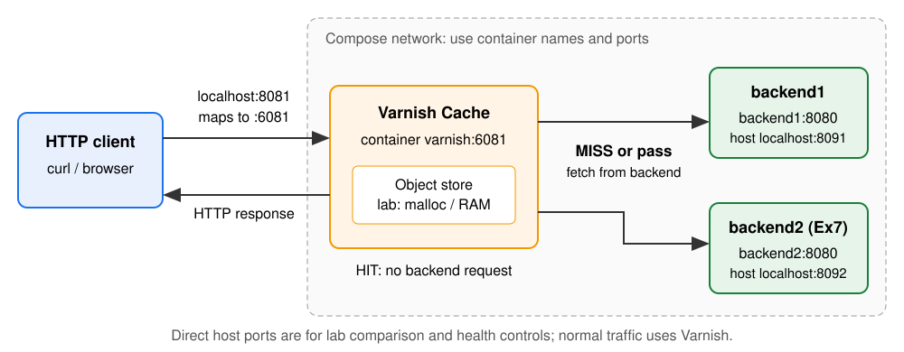
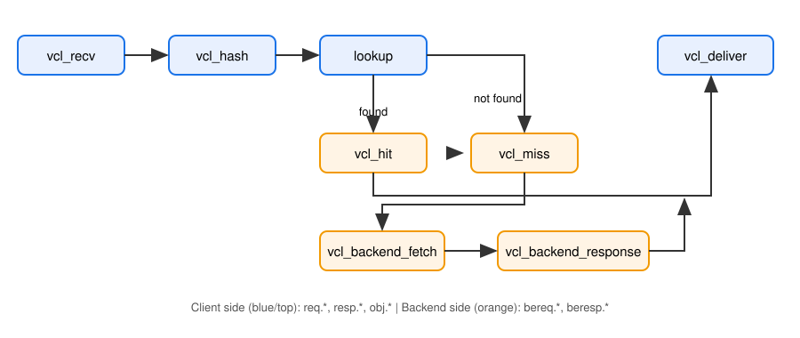

# Varnish Cache 6.0

## HTTP caching, one request at a time

Two guided **120-minute sessions** | Lab: **6.0.18**

Work in pairs: configure -> reload -> request -> observe.

`GUIDE.md` contains full commands; `OUTLINE.md` contains checkpoints.

---

# Session 1 | 120 Minutes

| Topic | Minutes |
|---|---:|
| Intro, topology, setup | 15 |
| Ex1: VCL fundamentals + backend1 | 20 |
| Ex2: Routing, headers + logs | 20 |
| Ex3: Request flow + Cache-Control | 20 |
| Break | 10 |
| Ex4: TTL, public cookies + Vary | 20 |
| Recap + checkpoint | 15 |

---

# What Varnish Does

- An **HTTP reverse proxy cache** in front of an application.
- HIT: reuse a cached response, avoiding a backend request.
- MISS or pass: contact the backend; cache only when policy permits.
- VCL controls routing, headers, caching and invalidation.
- Use cases: public pages, static assets, cacheable API GETs and traffic spikes.
- This lab uses **malloc memory storage**; Varnish also supports other storage backends, including file storage.

Varnish Cache is **not a TLS terminator**. Put an HTTPS terminator in front when needed; our lab uses HTTP.

---

# Lab Topology



---

# Setup And Repeatable Tests

```sh
make up && make check
export V=http://localhost:8081
export B1=http://localhost:8091 B2=http://localhost:8092
curl -sS -D - -o /dev/null "$V/static"
```

- Edit `varnish/vcl/default.vcl`, then `make reload`.
- These examples use **GET**, not `curl -I` / HEAD.
- Reload/reset do **not** flush cache or reset backend health.
- Use a fresh query token, then repeat the **same URL** for a HIT.

`make reset` restores the valid bootstrap, not an empty VCL.

---

# VCL Hooks And Scopes | Ex1

| Object | Meaning | Typical hook |
|---|---|---|
| `req` | Client request | `vcl_recv` |
| `bereq` | Request sent to backend | `vcl_backend_fetch` |
| `beresp` | Response from backend | `vcl_backend_response` |
| `resp` | Response sent to client | `vcl_deliver` |

`req.url` includes the query; `req.http.Host` is a request header.

`beresp.status` is the backend status; `resp.status` is the client response status. **Not** `resp.StatusCode`.

---

# Read The Syntax | Ex1

```vcl
sub vcl_recv {
    if (req.http.Host == "example.com" &&
        req.url ~ "^/test1([?].*)?$") {
        set req.backend_hint = backend1;
    }
    unset req.http.X-Remove-Me;
}
```

`==` equality | `~` regex | `set` assignment | `unset` removal

User hooks normally **fall through to built-in VCL**. Empty hooks still apply built-in cache policy. Explicit `return (pass)` or `return (hash)` ends the hook and can skip built-in safety checks.

---

# Ex1 | Declare Backend1 | 20 Min

Replace/rename the starter's `backend default` declaration:

```vcl
vcl 4.0;

backend backend1 {
    .host = "backend1";
    .port = "8080";
}
```

Keep a backend declaration: a no-backend VCL will not compile.

Reload; GET `$V/static` -> **200 from backend1**. Direct comparison: `$B1/static` uses host **8091**, not container 8080.

Check: `./verify.sh 1` | checkpoint: `01-backend.vcl`

---

# Ex2 | Internal Rewrite | 20 Min

In `vcl_recv`, match **exact Host** and **exact path**, allowing a query:

```vcl
if (req.http.Host == "example.com" &&
    req.url ~ "^/test1([?].*)?$") {
    set req.backend_hint = backend1;
    set req.url = regsub(req.url, "^/test1", "/nocache");
}
```

`/test1?route=ex2` -> backend `/nocache?route=ex2`

An **internal rewrite**, not a redirect: no client round trip or `Location`.
Do not rewrite `/test10`, `/test1/child`, another Host or `example.com:8081`.

---

# Ex2 | Request And Response Headers

```vcl
sub vcl_recv {
    set req.http.X-Workshop = "varnish-lab";
    unset req.http.X-Remove-Me;
    # Include the routing block here too.
}
sub vcl_deliver {
    set resp.http.X-Workshop = "varnish-lab";
    unset resp.http.Server;
    set resp.http.X-Cache-Hits = obj.hits;
}
```

Merge snippets into existing hooks. Keep lab `X-Backend` and `X-Cache` diagnostics visible.

---

# Ex2 | Prove It With Logs

```sh
# Terminal 1:
make vsh
# Inside the Varnish container:
varnishlog -g request
# Terminal 2 (host):
curl -sS -D - -o /dev/null -H 'Host: example.com' \
  -H 'X-Remove-Me: secret' "$V/test1?route=ex2"
```

- `ReqURL`: original `/test1?route=ex2`.
- `BereqURL`: rewritten `/nocache?route=ex2`.
- `BereqHeader`: `X-Workshop` present, `X-Remove-Me` absent.
- Mock echo: `X-Seen-Workshop: varnish-lab`; no removed value.

Repeat with negative Host/path cases. `./verify.sh 2` | `02-routing.vcl`

---

# Ex3 | HIT, MISS And Pass | 20 Min



---

# Cache-Control: HTTP vs Built-In Policy

| Directive | HTTP meaning |
|---|---|
| `s-maxage=60` | Shared-cache freshness; overrides `max-age` |
| `max-age=60` | Freshness for caches generally |
| `private` | Not for a shared cache |
| `no-store` | Do not store |
| `no-cache` | May store, but validate before reuse |

Varnish **6.0 built-in VCL makes `no-cache` uncacheable**; it is not a conditional-validation cache for that directive.

TTL derives from `s-maxage`, `max-age`, `Expires`, then default TTL; VCL can override it. `public` alone does not guarantee a HIT.

---

# Ex3 | Observe Reuse

```sh
u="$V/static?cb=ex3-$RANDOM"
curl -sS -D - -o /dev/null "$u"
curl -sS -D - -o /dev/null "$u"
curl -sS -D - -o /dev/null "$V/nocache"
curl -sS -D - -o /dev/null "$V/nocache"
```

- `/static`: **MISS -> HIT**. Compare `Age`, `X-Cache-Hits`, `X-Varnish` IDs.
- `/nocache`: no reusable response; every request reaches the backend.
- Inspect `VCL_call`, `TTL` and fetch records; HIT has no backend fetch.

Uncacheable responses can create **hit-for-miss markers**, not reusable bodies. Pass skips cache lookup; it is not the same as a MISS.

Check: `./verify.sh 3` | `03-cache.vcl`

---

# Break | 10 Min

## Before You Leave

Explain to your partner:

1. Which port does VCL use for backend1?
2. Where is the original URL visible after a rewrite?
3. Does a fresh HIT contact the backend?

Next: cache policy without leaking personalized content.

---

# Ex4 | Narrow Public-Content Policy | 20 Min

```vcl
# In vcl_recv:
if (req.url ~ "^/static([?].*)?$") {
    unset req.http.Cookie;
}
# In vcl_backend_response:
if (bereq.url ~ "^/time([?].*)?$") {
    set beresp.ttl = 5s;
}
if (bereq.url ~ "^/cookie([?].*)?$") {
    unset beresp.http.Set-Cookie;
}
```

These are **public mock endpoints only**. Boundaries exclude `/static-private` and `/static/child`. Never strip cookies globally or remove protections from personalized responses.

---

# Ex4 | TTL And Vary Evidence

- `/time`: compare bodies within and after **5s**. Grace can make the first response after expiry stale while refreshing.
- `/static`: repeat one URL with `Cookie: session=lab` -> MISS, HIT.
- `/cookie`: repeat one URL -> MISS, HIT; no `Set-Cookie`.

```sh
u="$V/vary?cb=ex4-$RANDOM"
curl -sS -D - -H 'Accept-Language: en' "$u"
curl -sS -D - -H 'Accept-Language: pl' "$u"
curl -sS -D - -H 'Accept-Language: en' "$u"
```

`Vary: Accept-Language` -> **en MISS, pl MISS, en HIT**.
Variants share a primary hash but differ by the declared header.

Check: `./verify.sh 4` | `04-ttl-vary.vcl`

---

# Session 1 Recap | 15 Min

Trace one request: **client -> recv -> lookup/fetch -> deliver**.

- Show a rewrite and a negative routing test.
- Explain built-in fallthrough and one cookie safety boundary.
- Show a MISS/HIT pair and two language variants.
- Save your working Ex4 VCL for session 2.

Checkpoint: `04-ttl-vary.vcl`. Ask a mentor before opening solutions.

---

# Session 2 | 120 Minutes

| Topic | Minutes |
|---|---:|
| Recap + restore Ex4 checkpoint | 10 |
| Ex5: TTL, grace + keep | 20 |
| Ex6: Authorized PURGE | 15 |
| Ex7: Director, probes + recovery | 20 |
| Break | 10 |
| Ex8: Monitoring | 15 |
| Ex9: Troubleshooting | 20 |
| Ex10: Tuning demo + wrap-up | 10 |

Restore: `make solution N=04-ttl-vary`; POST both backends `/health/up`.

---

# Ex5 | Three Lifetime Windows | 20 Min

For `/time` only, in `vcl_backend_response`:

```vcl
set beresp.ttl = 5s;
set beresp.grace = 1m;
set beresp.keep = 30s;
```

```text
Fetch        5s                         65s              95s
  |-- fresh --|-- stale allowed: grace --|-- keep only ---|
```

**TTL:** fresh reuse. **Grace:** stale delivery while refreshing / unavailable.
**Keep:** retain for possible conditional revalidation, **not stale delivery**.

The mock has no validators (ETag/Last-Modified): no 304 demo here.

---

# Ex5 | Protect Stale, Deliver Cold Errors

In `vcl_backend_response`, before normal cache policy:

```vcl
if (beresp.status >= 500) {
    if (bereq.is_bgfetch) {
        return (abandon);
    }
    set beresp.ttl = 0s;
    set beresp.uncacheable = true;
    return (deliver);
}
```

**Background refresh:** abandon the failed fetch; preserve the good stale object.
**Foreground/cold request:** deliver the error, but do not cache its body.

Do not abandon every foreground 5xx.

---

# Ex5 | Warm, Fail, Recover

```sh
curl -sS -X POST "$B1/health/up"
u="$V/time?cb=ex5-$RANDOM"
curl -sS "$u"
curl -sS -X POST "$B1/health/down"
sleep 7
curl -sS -D - "$u"
curl -sS -D - "$V/time?cb=ex5-cold-$RANDOM"
curl -sS -X POST "$B1/health/up"
```

Warm URL: stale **200** during grace. Cold URL: foreground error.
After recovery, repeat the warm URL and observe a refreshed body.

Always restore health, even on failure. `./verify.sh 5` | `05-grace.vcl`

---

# Ex6 | Authorized PURGE | 15 Min

```vcl
acl purge {
    "127.0.0.1"; "::1";
    "10.0.0.0"/8;
    "172.16.0.0"/12;
    "192.168.0.0"/16;
}
# In vcl_recv, after the workshop URL rewrite:
if (req.method == "PURGE") {
    if (client.ip !~ purge) { return (synth(403)); }
    return (purge);
}
```

**Lab-only RFC1918 ACL:** allows container sources, not a production authorization model. Production must narrowly authorize callers.

---

# Ex6 | Invalidate The Exact Hash

```sh
u="$V/static?cb=ex6-$RANDOM"
curl -sS -D - -o /dev/null -H 'Host: example.com' "$u"
curl -sS -D - -o /dev/null -H 'Host: example.com' "$u"
curl -sS -D - -o /dev/null -X PURGE -H 'Host: example.com' "$u"
curl -sS -D - -o /dev/null -H 'Host: example.com' "$u"
```

Expect **MISS -> HIT -> PURGE success -> MISS**.

- Default hash includes **URL (query too) + Host**: match both.
- PURGE removes **all Vary variants** under that exact hash, not other URLs.
- Prove **403** from outside the ACL; a forged forwarding header is not proof.

Ban is a different mechanism. `./verify.sh 6` | `06-purge.vcl`

---

# Ex7 | Add Backend2 And A Director | 20 Min

**Backend:** an origin address. **Director:** a backend-selection policy.

```vcl
import directors;
backend backend2 {
    .host = "backend2";
    .port = "8080";
}
sub vcl_init {
    new pool = directors.round_robin();
    pool.add_backend(backend1);
    pool.add_backend(backend2);
}
```

In `vcl_recv`: `set req.backend_hint = pool.backend();`
**Then** apply Ex2's exact route so it still forces backend1.

---

# Ex7 | Probe Both Backends

**Probe:** a periodic health check used when selecting backends.

```vcl
probe health {
    .url = "/healthz";
    .interval = 2s;
    .timeout = 1s;
    .window = 3;
    .threshold = 2;
}
```

Add `.probe = health;` to **both** backend declarations.

Healthy requires 2 successes in the last 3 checks. The director skips sick members; health transitions are **not immediate**.

Inside `make vsh`: `varnishadm backend.list`

---

# Ex7 | Balance, Fail Over, Rejoin

1. POST `$B1/health/up` and `$B2/health/up`; await healthy status.
2. Repeated GET `$V/nocache`: observe both `X-Backend` values.
3. POST `$B1/health/down`; await sick status in `backend.list`.
4. Normal `/nocache` traffic now uses backend2.
5. POST `$B1/health/up`; await healthy, observe backend1 rejoin.

Use **idempotent up/down**, not `/toggle`. Allow several probe intervals.
HITs do not show balancing: they never contact either backend.

Ex2's rewritten route remains pinned to backend1, outside pool failover.

Check: `./verify.sh 7` | `07-director.vcl`

---

# Break | 10 Min

## Before You Leave

- Restore both backends to **up** and wait for probe health.
- Explain why keep is not another stale-serving window.
- Explain why changing Host can make a PURGE miss its target.

Next: collect evidence before changing configuration.

---

# Ex8 | A Small Operational Toolkit | 15 Min

Run inside `make vsh`:

| Tool | Actionable question |
|---|---|
| `varnishstat` | Are hit/miss deltas changing? Eviction pressure? |
| `varnishlog -g request` | Which hook, TTL or fetch failed? |
| `varnishncsa` | What status/latency did the client see? |
| `varnishtop -i ReqURL` | Which URLs dominate traffic? |

Start with `MAIN.cache_hit`, `MAIN.cache_miss`, `MAIN.n_lru_nuked`.
Use **counter deltas**, not lifetime totals as a current rate.

For health and 503s: `varnishadm backend.list` + `FetchError` records.

---

# Ex8 | Capture Four Pieces Of Evidence

```sh
varnishlog -g request -q 'ReqURL ~ "static"'
```

Generate repeated and unique GET URLs from another terminal.

Record:

1. A request trace with HIT/MISS and whether a backend was fetched.
2. Hit/miss counter deltas for that traffic.
3. One access-log entry with status and latency.
4. A frequent URL from `varnishtop`.

**Manual exercise:** no separate VCL; no `./verify.sh 8` selector.

---

# Ex9 | One Broken Config Per Pair | 20 Min

Each config is final VCL **plus one fault**. Repair one during class.

| File | Symptom |
|---|---|
| `broken/b1.vcl` | `/static` never HITs |
| `broken/b2.vcl` | Only backend2 serves normal traffic |
| `broken/b3.vcl` | Separate objects per User-Agent |

```sh
cp broken/b1.vcl varnish/vcl/default.vcl && make reload
# Gather evidence, edit the fault, reload, then:
./verify.sh 9
```

Fresh query tokens prevent old objects masking repairs. Explain the cause and show evidence before editing. Other faults are optional follow-up.

---

# Ex9 | Diagnose Before Editing

| Symptom | Evidence to inspect |
|---|---|
| Never HIT | `TTL`, cookies, `Vary`, hash inputs, `VCL_call` |
| 503 | Backend health, `FetchError`, cold vs stale |
| Wrong backend | `X-Backend`, `BackendOpen`, route, pool |
| Cannot reload | Compiler error and active VCL |

Optional: replace `resp.status` with invalid `resp.StatusCode`.
Reload fails to compile; **the previous active VCL still serves**.
Fix the typo, reload, confirm behavior.

`./verify.sh 9` checks the three fault symptoms, not every final setting.

---

# Ex10 | Tuning Demo + Wrap-Up | 10 Min

**Mentor demo only:** reduce storage, generate unique `/static?u=...` GETs.

```sh
make down && VARNISH_MEM=1m make up
# Inside make vsh, after generating traffic:
varnishstat -1 -f MAIN.n_lru_nuked -f MAIN.n_object
```

Evictions mean **storage pressure**, not automatically "cache too small".
Consider working set, churn, hit ratio and latency; no fixed eviction count.

Thread tuning is a discussion, not a lab: examine saturation before changing `thread_pool_min/max`.
Restore: `make down && make up`. No verifier selector for Ex10.

---

# Take It Back To Your Service

- Cache only content safe to share; preserve user boundaries.
- Distinguish fresh reuse, stale grace and retention for revalidation.
- Scope routes, cookie changes, error handling and PURGE authorization.
- Verify health recovery, not just failure.
- Use logs and counter deltas before tuning.

Verifier: `./verify.sh N` accepts **1-7 and 9**; Ex8/10 are manual.
No argument checks all automated behavior on the final VCL.

Next steps: conditional 304 revalidation, bans, ESI and TLS deployment.

---

# Appendix | Official References

Local diagrams work offline; these are **links**, not required images.

- [Official request state diagram](https://varnish-cache.org/docs/6.0/_images/cache_req_fsm.svg)
- [Official backend fetch diagram](https://varnish-cache.org/docs/6.0/_images/cache_fetch.svg)
- [States and hooks](https://varnish-cache.org/docs/6.0/reference/states.html)
- [VCL reference](https://varnish-cache.org/docs/6.0/reference/vcl.html) | [Built-in VCL](https://varnish-cache.org/docs/6.0/users-guide/vcl-built-in-code.html)
- [Grace and keep](https://varnish-cache.org/docs/6.0/users-guide/vcl-grace.html) | [Invalidation](https://varnish-cache.org/docs/6.0/users-guide/purging.html)
- [Varnish 6.0 docs](https://varnish-cache.org/docs/6.0/) | [Source and issues](https://github.com/varnishcache/varnish-cache) | [Mailing lists](https://varnish-cache.org/lists/)
